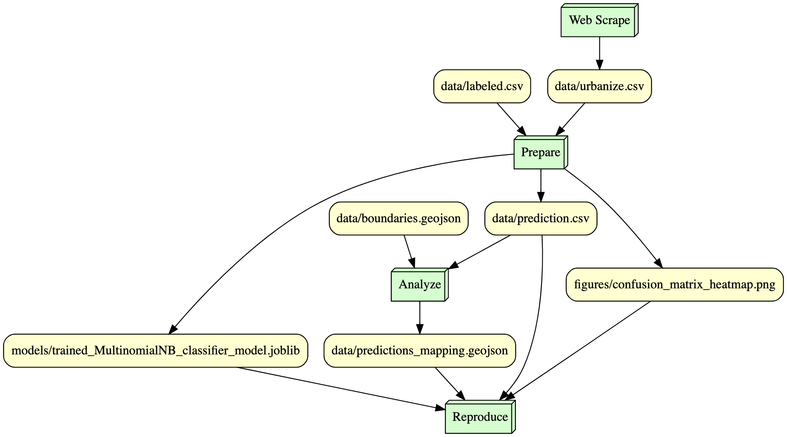

# affordable_housing_mapping
## WIP Progress Project Utilizing Urbanize Chicago Media, NLP, Classification to map affordable housing projects in Chicago. More work to come! 

### Updates as of March 2024:
Currently reviewing text classification methods:
* * Schopf, T., Braun, D., & Matthes, F. (2021). *Lbl2Vec: An Embedding-based Approach for Unsupervised Document Retrieval on Predefined Topics*. In *Proceedings of the 17th International Conference on Web Information Systems and Technologies*. SCITEPRESS - Science and Technology Publications. [DOI: 10.5220/0010710300003058](http://dx.doi.org/10.5220/0010710300003058)

